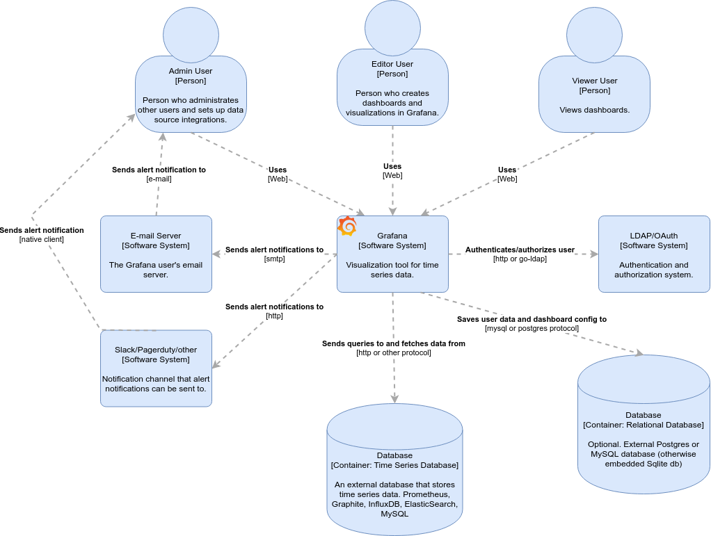
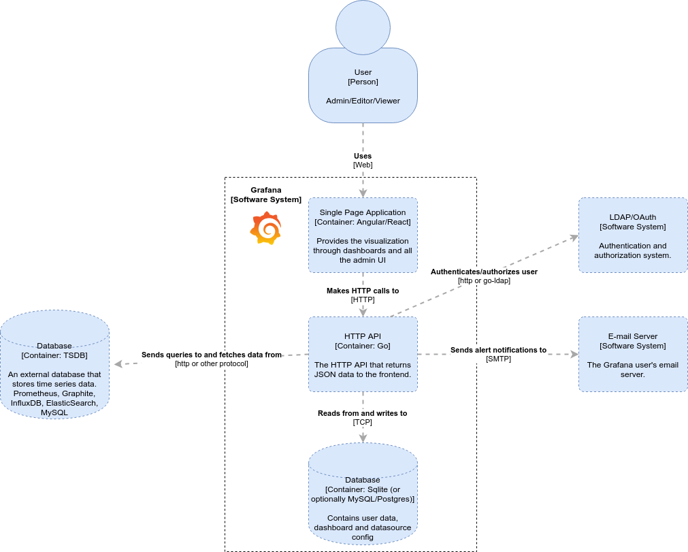
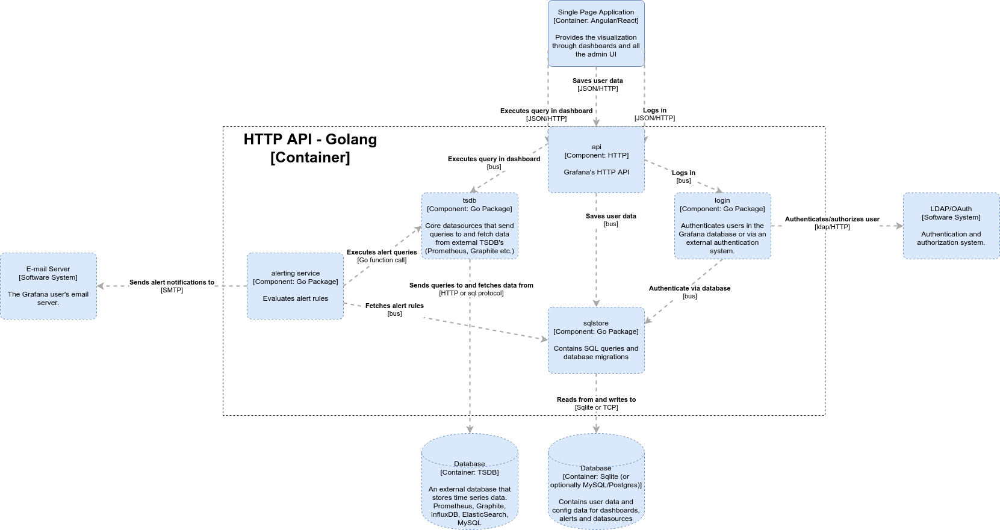

# Grafana Architecture Overview

This is an overview of Grafana's architecture using the [C4 Model](https://c4model.com/) for the diagrams.

## System Context Diagram

The System Context Diagram shows the big picture of how users interact with Grafana and how Grafana integrates with external systems.

- Grafana visualizes time series data. The time series data is stored in an external database (like Graphite or Prometheus).
- The Grafana data (users, dashboards, config) is stored in an embedded Sqlite database or in an external database (MySQL or Postgres).
- Grafana can optionally integrate with an external authentication system (LDAP, OAuth or SAML) for authentication on login and for authorizing users. (the three main roles: Admin, Editor, Viewer).
- Grafana can integrate with an external email server to send emails for invites and alert notifications.

## Container Diagram

The Container diagram zooms in on the Grafana system.

- Grafana has a backend component written in Go. It exposes an HTTP API.
- Grafana has a frontend Single Page App (SPA) component written in React/Angular.

## Backend Architecture

The Grafana backend consists of an HTTP API and backend services. Some of the services like the alerting service run as background services too. All API requests are routed to an API handler and then usually an event is sent over the event bus and the services listen for these events. For example, the login route handler might dispatch a `LoginUserQuery` event over the bus and the login service will pick it up and execute the query.

- When a user logs in, the login service uses either the internal Grafana database to fetch user details for authentication or an external system via LDAP or OAuth.
- There are is no service for saving user data - the HTTP API makes a call to the SqlStore package to save config data to the database. This means there is a lot of validation logic in the sql package.
- Dashboard queries are proxied through the Grafana backend and forwarded to the external time series database (TSDB).
- The alerting service is run in the background and executes the alert rules every 10 seconds. It fetches the alert rules from the Grafana database and then executes the queries contained in the rules - to do this it calls the TSDB package. If an alert is generated then an alert notification is sent via an external system - email, Slack, Pagerduty etc.

